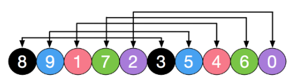
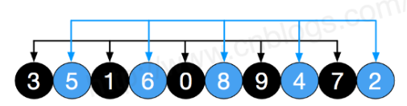
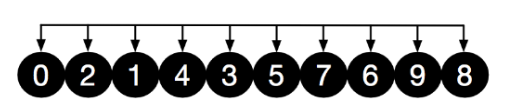

# 4、希尔排序（Shell Sort）

シェルソート（改良挿入ソート、英語: Shellsort）は、1959年に（Donald Shell）によって提案されたソーティングアルゴリズムです。 シェルソートも一種の挿入ソートであり、改良後の単純な挿入ソートのより効率的なバージョンであり、縮小インクリメンタルソートとも呼ばれます。同時に、このアルゴリズムはO（n2）を破る最初のアルゴリズムの1つです。挿入ソートとの違いは、最初に離れている要素を比較することです。 

**シェルソートとは、テーブルに従ってレコードを特定の増分でグループ化し、直接挿入ソートアルゴリズムを使用して各グループをソートすることです。増分が減少すると、増分が1に減少すると、各グループに含まれるキーワードが増えます。ファイル全体が1つのグループに分割され、アルゴリズムが終了します。**

## 4.1 アルゴリズムの説明
シェルソートの基本的な手順を見てみましょう。ここでは、増分gap=length/2を選択し、縮小増分はgap=gap/ 2で続行します。この増分選択はシーケンス{n / 2、 （n / 2）/ 2 ... 1}、インクリメンタルシーケンスと呼ばれます。 ヒルソートのインクリメンタルシーケンスの選択と証明は数学的な問題です。選択するインクリメンタルシーケンスがより一般的に使用され、ヒルインクリメンタルと呼ばれるヒルによって提案されたインクリメンタルでもありますが、実際には、このインクリメンタルシーケンスは最も優れています。 ここでは、例としてヒルインクリメントを使用します。

最初に、ソートされるレコードのシーケンス全体をいくつかのサブシーケンスに分割して、直接挿入ソートを行います。具体的なアルゴリズムの説明は次のとおりです。

* インクリメンタルシーケンスt1、t2、...、tkを選択します。ここでti> tj、tk = 1;
* インクリメントシーケンスの数kに従ってシーケンスをk回ソートします；
* 毎回のソートでは、対応する増分tiに従って、ソートされるシーケンスが長さmのいくつかのサブシーケンスに分割され、各サブテーブルが直接挿入されてソートされます。 増分係数が1の場合のみ、シーケンス全体がテーブルとして扱われ、テーブルの長さはシーケンス全体の長さになります。

## 4.2 動作例

初期データ:


間隔gap=length/2=5でみる。 色の同じところは、同じグループのデータ列である。[8,3], [9,5], [1,4], [7,6], [2,0]



同じグループ内で挿入ソートし、間隔をgap=5/2=2にする。[3,1,0,9,7], [5,6,8,4,2]



同じグループ内で挿入ソートし、間隔をgap=2/2=1にする。[0,2,1,4,3,5,7,6,9,8]



間隔1ということは、全体が同じ1つのグループということである。これを挿入ソートする。


## 4.3 実装

```java
　　/**
     * Shell Sort
     *
     * @param array
     * @return
     */
    public static int[] ShellSort(int[] array) {
        int len = array.length;
        int temp, gap = len / 2;
        while (gap > 0) {
            for (int i = gap; i < len; i++) {
                temp = array[i];
                int preIndex = i - gap;
                while (preIndex >= 0 && array[preIndex] > temp) {
                    array[preIndex + gap] = array[preIndex];
                    preIndex -= gap;
                }
                array[preIndex + gap] = temp;
            }
            gap /= 2;
        }
        return array;
    }
``` 

## 4.4 性能評価

シェルソートの中核は、インターバルシーケンスの設定です。 インターバルシーケンスは事前に設定することも、インターバルシーケンスを動的に定義することもできます。 間隔シーケンスを動的に定義するためのアルゴリズムは、「アルゴリズム（第4版）」の共著者であるRobert Sedgewickによって提案されました。

* 最良時間計算量：T(n) = O(nlog2 n)  
* 最悪時間計算量：T(n) = O(nlog2 n)  
* 平均時間計算量：T(n) =O(nlog2n)　
